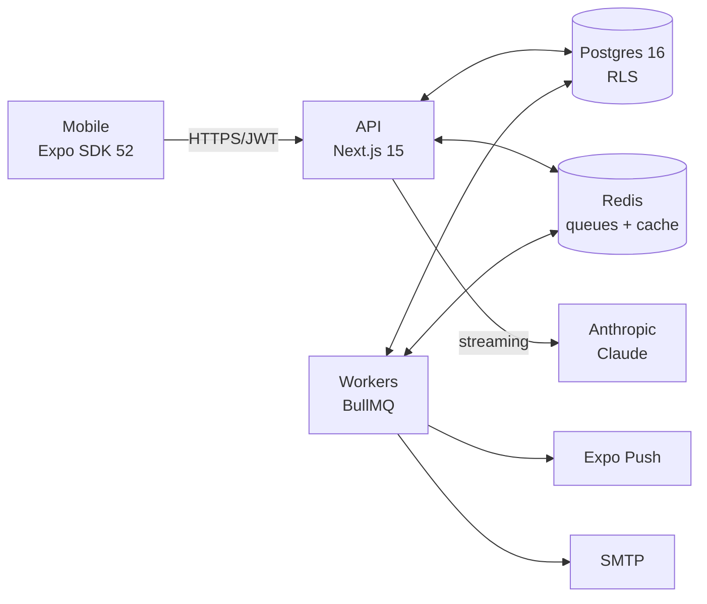

# CyMetric

> Cybersecurity health scorecard for organisations — self-assess 46 KPIs across People, Process, and Company; get personalised AI-guided remediation.


**Live API:** https://cyberscore-api.vercel.app  ·  [Health check](https://cyberscore-api.vercel.app/api/v1/health)
**Demo video:** [Watch on OneDrive](https://iiitbac-my.sharepoint.com/:v:/g/personal/saanvi_vishal_iiitb_ac_in/IQA6_RpGKPsHTp2JsEX8W6dVAdQG0jaFrzJQZSFKEfj32Wk?nav=eyJyZWZlcnJhbEluZm8iOnsicmVmZXJyYWxBcHAiOiJPbmVEcml2ZUZvckJ1c2luZXNzIiwicmVmZXJyYWxBcHBQbGF0Zm9ybSI6IldlYiIsInJlZmVycmFsTW9kZSI6InZpZXciLCJyZWZlcnJhbFZpZXciOiJNeUZpbGVzTGlua0NvcHkifX0&e=B6uqLC) (IIIT Bangalore SharePoint)
**Demo APK:** see latest EAS build in [docs/access-credentials.md](docs/access-credentials.md)
**Demo login:** `saanvi.vishal@iiitb.ac.in` / `cyberscore-demo-2026`

---

## What is this?

A **mobile-first app** that lets organisations self-assess cybersecurity posture and turn the result into a concrete action plan. The KPI set is mapped to find teh best **KPI scorecard at a personal, process and company level** it also offeres you to choose other frameworks like **NIST CSF 2.0** and **ISO 27001** control families. The product has:

- A **React Native mobile app** (Expo SDK 52, iOS + Android)
- A **Next.js 15 API** with Prisma 6 / Postgres 16 / BullMQ workers on Redis
- **AI-powered chat advisor** that knows your live scorecard (A RAG LLLM that helps you give isnights about ypur industry and help ypu assess where ypu stand as per ypur score adn how you can improve to compete.)
- **Two operating modes:** SOLO (single user) and ENTERPRISE (admin + employees with per-user level permissions)



## Quick start (try the app)

The app is already built, deployed, and ready to install. You do not need to clone the repo or run any servers locally to try it. Everything talks to the live API at `https://cyberscore-api.vercel.app`.

### Install on an Android phone

1. On your Android phone, open this link in Chrome:

   https://expo.dev/accounts/saanviiiiiiiiiiiiii/projects/cyberscore/builds/b7344fac-77cf-4ead-8eed-3a22f714458a

2. Tap **Install** on the Expo build page. A QR code and a direct **Download** button will appear.
3. Either scan the QR code with the phone camera, or tap **Download** to grab the `.apk` file directly. The file is around 50 MB and takes a few seconds on Wi-Fi.
4. When the download finishes, tap **Open** in the notification. Android will say something like "for your security your phone is not allowed to install unknown apps from this source." Tap **Settings**, switch **Allow from this source** on, hit back, then tap **Install**.
5. Once the install finishes, tap **Open**. The CyMetric icon also appears in your app drawer.

### Sign up and log in

When the app opens, the onboarding carousel plays (three slides). Tap Skip or Next a few times to reach the login screen. From there:

1. Tap **Register** at the bottom of the login screen.
2. Pick a mode:
   - **SOLO** for a single user trying the product out for themselves.
   - **ENTERPRISE admin** if you also want to invite team members and assign each one specific assessment areas (People, Process, Company).
3. Fill in your name, your work or personal email, your organisation name, and your industry. Pick a strong password (eight characters or more, mixed case, at least one number).
4. Tap Register. A one-time verification code is emailed to you within a few seconds. Sometimes it lands in the Promotions or Spam folder the first time, since the sender is new to your inbox.
5. Enter the code on the next screen and you are in.

The first time you sign in, your dashboard is empty because you have not answered any KPIs yet. Tap Assessment and start answering. Your score updates live as you go.

If you ever forget your password, use the **Forgot password** link on the login screen. It emails another one-time code that lets you set a new password.

### Local login

For local development you have two paths:

1. **Register a fresh account** in the running app. Use any email. In dev mode the OTP is printed in the API server logs and also returned inline in the response, so you do not need a real SMTP server to verify.
2. **Use a seeded account** if you ran `npm run db:seed` and your local Postgres has the demo seed data. Check `apps/api/scripts/seed-demo-user.ts` for the credentials that the seed creates locally. Note this only exists in databases you seeded yourself. The same credentials will not work against the production Vercel API unless you also re-ran the seed script there.

## Prerequisites

| | Minimum |
|---|---|
| Node.js | 20.x |
| npm | 10.9+ (or 11.x) |
| PostgreSQL | 16 |
| Redis | 6+ |
| Xcode + iOS Simulator | for iOS dev — macOS only |
| Android Studio | for Android dev |

Install Postgres + Redis on macOS:

```bash
brew install postgresql@16 redis
brew services start postgresql@16
brew services start redis
createdb cymetric
```

## Repository layout

```
cymetric/
├── apps/
│   ├── api/                      # Next.js 15 API
│   │   ├── src/
│   │   │   ├── app/api/v1/       # 54 REST routes (auth, kpis, scorecard, ai, admin, team, evidence, notifications, share, keepwarm, health, ...)
│   │   │   ├── lib/              # auth, prisma, ai, scoring, access, email, queue, advisor-local, ...
│   │   │   ├── workers/          # email, snapshot, push, abandonment + scheduler (dormant on Vercel)
│   │   │   ├── middleware.ts     # CORS for dev, security headers
│   │   │   └── pages/            # pages-router fallback (_error.tsx) for the 15.1.3+React 19 prerender bug
│   │   ├── prisma/               # schema, 7 migrations, seed script, seed/extract-kpis.py
│   │   ├── scripts/              # seed-demo-user.ts (plant demo user against any DB), set-dev-otp.ts
│   │   └── vercel.json           # pins serverless functions to sin1 (Singapore) region
│   │
│   └── mobile/                   # Expo SDK 52 / RN 0.76.9 / NativeWind 4
│       ├── app/                  # expo-router file-based routes
│       │   ├── (auth)/           # onboarding, login, register, verify-otp, forgot, reset-password, invite
│       │   └── (app)/            # dashboard, assessment, kpi/[id], results, scorecard, analytics, insights (chat), profile, team
│       ├── src/
│       │   ├── components/       # Screen, TopBar, Card, Button, Input, ScoreRing, ...
│       │   ├── lib/              # api client, chatStream, queryClient, storage
│       │   ├── stores/           # zustand auth store
│       │   ├── styles/           # global.css (NativeWind setup)
│       │   └── theme/            # colors, typography
│       ├── app.json              # Expo config, EAS projectId
│       └── eas.json              # preview (sideload APK) and production (Play Store AAB) build profiles
│
├── packages/
│   ├── sdk/                      # @cymetric/sdk. Typed fetch client with auto-refresh on 401.
│   └── types/                    # @cymetric/types. Zod schemas shared by API and mobile.
│
├── docs/
│   ├── architecture.md           # System architecture and tech stack rationale
│   ├── system-design.md          # HLD plus LLD with mermaid diagrams
│   ├── requirements.md           # Functional, non-functional, software requirements
│   ├── database.md               # Schema, ER diagram, RLS notes
│   ├── deployment.md             # Production runbook for the live Vercel + Neon + Upstash + Brevo stack
│   ├── known-issues.md           # Bugs, incomplete features, gotchas
│   ├── roadmap.md                # What to build next, by priority
│   ├── sprints.md                # Week-by-week build history
│   ├── access-credentials.md     # Every external service, where each secret lives, transfer procedure
│   ├── handover-notes.md         # Key decisions, challenges, lessons learned, tips
│   ├── testing-manual.md         # Scripted manual test plan (smoke and full regression)
│   ├── cyberscore-final-report.pdf  # 24-page handover deliverable
│   └── generate_handover_pdf.py  # Script that builds the PDF from the markdown content
│
├── scripts/
│   └── setup.sh                  # One-shot bootstrap (install deps, copy .env, migrate, seed)
│
├── .env.example                  # API env var template
├── .gitignore
├── .nvmrc                        # Node 22.x
├── package.json                  # npm workspaces and turbo orchestration
├── turbo.json                    # Task pipelines (build, lint, typecheck, test, dev)
├── tsconfig.base.json            # Strict TypeScript shared across workspaces
├── README.md                     # This file
├── HANDOVER_CHECKLIST.md         # Mohan's 20-section checklist with current status
├── CHANGELOG.md                  # Keep-a-Changelog format
├── CONTRIBUTING.md               # Branching, commits, PR process
└── LICENSE                       # MIT
```

## What the app actually does

### For solo users

- Sign up with your own email. A six-digit verification code is sent to you through Brevo. Enter it to activate the account.
- Self-assessment across 46 KPIs grouped under People, Process, and Company. Each KPI has between three and five answer tiers with concrete language so you know which one matches you.
- Live scorecard. The score updates the moment you submit an answer. You get an overall score, a score per level, and a colour band (Red, Amber, Green) so you can see at a glance where you stand.
- Trend chart. Every score recompute writes a historical snapshot, so the analytics screen shows how the score has changed over time.
- A built-in advisor chat. Ask it things like "where am I weakest" or "what are the top threats for Banking" and you get a reply grounded in your actual answers, not a generic LLM answer. Replies arrive word by word, like ChatGPT.
- Personalised remediation suggestions. For every underperforming KPI, the app surfaces a short action you can take to fix it.
- Evidence file uploads attached to specific answers (planned, the storage bucket is the part that still needs wiring).
- Two-factor authentication using any standard authenticator app like Google Authenticator or Authy.
- Shareable read-only scorecard URLs, so you can show your score to your CISO or insurance provider without giving them an account.
- Forgot-password flow. Enter your email on the login screen and a fresh six-digit code arrives in your inbox within seconds.

### For enterprise admins

Everything above, plus:

- Invite employees by email. Each invite carries a pre-assigned set of allowed levels (any combination of People, Process, Company), so a finance employee can answer Process questions while an HR employee only sees People questions.
- Team dashboard with per-member completion percentage, score, and last activity timestamp.
- Edit any employee's allowed levels at any time. Useful when someone changes role.
- Locked framework. If you set it on, employees cannot switch the org from EXCEL framework to NIST CSF to ISO 27001. Only the admin can.
- Aggregated team scorecard with consensus signals on ORG-scope KPIs. If three employees give different answers to the same shared question, the admin sees the disagreement and the admin's answer wins for the rollup.
- Audit log for every team-related change. Who invited whom, who edited which levels, who revoked which employee, all recorded with actor, timestamp, and before/after state.

### For developers (the next batch who pick this up)

- Type-safe end to end. All request and response shapes live as Zod schemas in `packages/types` and are imported by both the API and the mobile app. Change the schema in one place and the type errors propagate everywhere.
- Strict TypeScript everywhere. Settings like `noUnusedLocals` and `noUncheckedIndexedAccess` are on, which catches a huge category of bugs at compile time.
- Append-only migrations with Prisma 6. Every schema change has a numbered migration file that the next batch can read end to end as a history.
- Append-only audit log for every security-relevant action. Useful for compliance reviews and for figuring out who did what when something goes wrong.
- Error responses follow RFC 7807 Problem Details. So you always know the error code, the human-readable title, and the trace ID for support.
- Structured Pino logs in JSON, queryable in Vercel's Functions tab by route, level, message, and error fields.
- Turbo pipelines for lint, typecheck, build, test. Cacheable across the monorepo so CI is fast.
- Row Level Security on all tenant tables. Even if a route handler forgets a `where: { orgId }` clause, Postgres refuses to return another organisation's rows.

## Tech stack

| Layer | Choice | Why |
|---|---|---|
| Mobile UI | Expo SDK 52, React Native 0.76, NativeWind 4 | Single codebase for iOS and Android. Expo gives access to native APIs like SecureStore, biometrics, and push notifications without writing native code. |
| Mobile state | TanStack Query 5, Zustand 5 | TanStack Query for server cache and request lifecycle. Zustand for the small auth store that survives across React tree remounts. |
| Server | Next.js 15.5 (App Router) | Route handlers without a separate Express layer. Good Vercel support. Same framework story we would use if we ever added a web dashboard. |
| Database | PostgreSQL 16 with Prisma 6 | Relational, with the schema as the source of truth. Row Level Security gives us tenant isolation even if a route handler forgets to scope by orgId. |
| Cache and queue | Redis on Upstash | Holds rate-limit counters, the KPI catalogue cache, and the (currently dormant) BullMQ queue. TLS connection over port 6379. |
| Auth | Argon2id passwords plus JWT plus opaque refresh tokens | Argon2id is the OWASP recommendation for password hashing. JWTs let route handlers verify auth without a database hit. Refresh tokens are bcrypt hashed at rest and rotated on every use. |
| AI advisor | Local rule based advisor by default. Anthropic Claude (Sonnet 4.6 primary, Haiku 4.5 fallback) as an optional upgrade. | The local advisor is free, deterministic, and grounded in the user's actual scorecard plus a hand-curated sector knowledge primer for 8 industries. Anthropic is wired up but switched off by default because the demo runs on a zero-budget account. Flip USE_LOCAL_ADVISOR to false to switch over. |
| Email | Brevo HTTP API (Free tier, 300 emails per day) | We pick the HTTP API over raw SMTP because Vercel's serverless functions sometimes throttle outbound TCP on ports 465 and 587. The email helper auto-detects Brevo keys (prefix xkeysib) and routes accordingly. |
| Validation | Zod 3 | Schemas live in packages/types and are shared by API and mobile, so request and response shapes can never drift. |
| Logging | Pino | Structured JSON logs, low overhead, easy to query in Vercel's Functions tab. |
| Mobile SSE | react-native-sse | The React Native old architecture does not expose Response.body as a usable ReadableStream, so the standard fetch streaming approach hangs. react-native-sse uses XMLHttpRequest under the hood and works reliably. |
| Build | Turbo 2 with npm workspaces | Cacheable lint, typecheck, build, and test across the monorepo. Both for local dev and (eventually) for CI. |
| Hosting | Vercel (Hobby, sin1 region) + Neon Postgres (Singapore) + Upstash Redis (Singapore) + Brevo email + EAS Build (Android) + cron-job.org (keep-warm) | Every service is on a free tier. Total monthly cost at handover is zero rupees. All three data plane services are in the Singapore region so the API and database round-trip latency stays under 10ms. |

See [docs/architecture.md](docs/architecture.md) for the full rationale.

## Documentation

| If you want to... | Read |
|---|---|
| Understand the system at a glance | [docs/architecture.md](docs/architecture.md) |
| See HLD + LLD with diagrams | [docs/system-design.md](docs/system-design.md) |
| Know what the product does | [docs/requirements.md](docs/requirements.md) |
| Set up the database | [docs/database.md](docs/database.md) |
| Deploy to production *(now: an actual runbook for the live stack)* | [docs/deployment.md](docs/deployment.md) |
| Know what's broken or incomplete | [docs/known-issues.md](docs/known-issues.md) |
| Plan the next batch's work | [docs/roadmap.md](docs/roadmap.md) |
| Read the sprint-by-sprint build history | [docs/sprints.md](docs/sprints.md) |
| Find every external service + how to take it over | [docs/access-credentials.md](docs/access-credentials.md) |
| Read the narrative of key decisions / lessons / tips | [docs/handover-notes.md](docs/handover-notes.md) |
| Manually verify everything works | [docs/testing-manual.md](docs/testing-manual.md) |
| Contribute | [CONTRIBUTING.md](CONTRIBUTING.md) |
| See what changed when | [CHANGELOG.md](CHANGELOG.md) |
| Verify handover deliverables | [HANDOVER_CHECKLIST.md](HANDOVER_CHECKLIST.md) |

There's also `apps/mobile/HANDOFF.md` from the prior batch — useful design context.

## Common issues

| Symptom | Cause | Fix |
|---|---|---|
| Network error in the app, but the API works fine in Chrome on the same phone | Phone briefly lost Wi-Fi during the request, or app cached a stale error from before the network came back. | Force close the app (swipe it away from the recents view) and reopen. If still broken, try switching between Wi-Fi and mobile data once. |
| App says "Too many requests" on login | Rate limit kicked in after multiple failed attempts. Current limit is 30 login attempts per IP per 15 minutes. | Wait until the next 15-minute window starts. Or if you know what you are doing, clear the Redis key `rl:login:ip:<your-ip>:<bucket>` from Upstash console. |
| Dashboard does not show the MANAGE button | The signed-in user's organisation is in SOLO mode. MANAGE only appears for ENTERPRISE admins. | If this is the demo user, run `apps/api/scripts/seed-demo-user.ts` against the production database to flip the mode to ENTERPRISE. Then log out and log back in on the phone. |
| Every page transition feels slow (5 to 15 seconds) | Vercel serverless functions went idle and the first request pays a cold-start tax. | Check the cron-job.org dashboard to confirm the keep-warm job (every 2 minutes, hits `/api/v1/keepwarm`) is still firing green. If it is paused, restart it. If you do not have a cron set up, follow the steps in `docs/deployment.md`. |
| `Network error: Could not reach the AI service` (local dev) | LAN IP on your Mac changed since Metro started. The mobile app on your phone is pointing at the old IP. | Restart Metro with the current LAN IP: `EXPO_PUBLIC_API_URL=http://$(ipconfig getifaddr en0):3000 npm run start --workspace @cymetric/mobile` |
| API returns 500 with "Objects are not valid as a React child" (local dev) | A route handler module threw at import time. Usually a Zod env validation failure from an invalid placeholder in `.env`. | Check the server logs from the same timestamp. Fix the env var that failed validation. Restart `npm run dev`. |
| "Unable to resolve module react-native-sse" or similar after `npm install` | Metro's cache is stale and did not pick up the new package. | Restart Metro with `npx expo start --clear`. |
| `npm run worker` exits with code 1 (local dev) | A placeholder env var in `.env` fails Zod URL validation. Common culprits are `R2_ENDPOINT=https://<accountid>...` and similar templates. | Open `.env`, comment out or fill in the offending variable, restart the worker. |
| `EADDRINUSE :3000` when starting the API | Another API process is already listening on port 3000. | Find it with `lsof -nP -iTCP:3000 -sTCP:LISTEN`. Kill that process. Restart. |
| Login fails with "Invalid email or password" but the credentials look correct | The password actually was reset by an earlier test run, or the email has an autocorrect typo (capital S, trailing space, etc.). | Tap **Forgot password** on the login screen. A real OTP email arrives through Brevo within 10 seconds. Set a new password. |
| Chat replies feel generic and never mention your specific KPIs | The chat is calling Anthropic instead of the local advisor, and your Anthropic account is empty or has hit the daily budget. | Confirm `USE_LOCAL_ADVISOR=true` is set in Vercel env vars. If it is, the local advisor is running and replies should reference your actual scorecard. If you want richer Anthropic replies, top up the Anthropic account and flip `USE_LOCAL_ADVISOR` to `false`. |
| OTP email never arrives at signup or password reset | Either the Brevo API key in `SMTP_PASS` is wrong, or Brevo rejected the send. | Open Brevo console, go to Transactional, then Statistics. The send attempt is logged there with the reason for rejection. Common cause: free tier daily quota of 300 emails reached. |

See [docs/known-issues.md](docs/known-issues.md) for the full list.

## Environment variables

Copy `.env.example` to `apps/api/.env` and fill in the values below. None of them belong in git, so `.env` is in `.gitignore` at every level. Production values live in the Vercel project settings, not in any file.

### Required for local development

```env

See [docs/deployment.md](docs/deployment.md) for the production set.

## Scripts

All commands run from the repo root unless noted otherwise.

### Everyday development

```bash
npm run dev          # Run every workspace in dev mode through Turbo.
                     # In practice you usually run the workspaces individually instead (see below).
npm run build        # Build everything. For the API this is `prisma generate` followed by `next build`.
npm run lint         # Lint every workspace.
npm run typecheck    # Run `tsc --noEmit` across every workspace.
npm run test         # Run vitest. Currently no tests exist, so this is a no-op.
npm run clean        # Remove .next, .turbo, dist, and node_modules. Use when something feels stuck.
```

### Database

```bash
npm run db:generate  # Regenerate the Prisma client from schema.prisma.
                     # Run this after pulling a schema change from git.
npm run db:migrate   # Apply pending migrations and prompt to create a new one if the schema changed.
                     # Local dev only. Uses DIRECT_DATABASE_URL.
npm run db:seed      # Upsert the 46 KPIs, 212 tiers, and 92 suggestions into your database.
                     # Safe to run repeatedly.
```

### Workspace-scoped (when you only want one process at a time)

```bash
# API on http://localhost:3000
npm run dev --workspace @cymetric/api

# BullMQ workers (email, snapshot, push, abandonment).
# Optional for local dev because email now sends inline through Brevo.
npm run worker --workspace @cymetric/api

# Metro bundler for the mobile app on http://localhost:8081
npm run start --workspace @cymetric/mobile
```

### API extras

```bash
# Prisma Studio: a web GUI to browse and edit the database. Opens on http://localhost:5555.
npm run db:studio --workspace @cymetric/api

# Non-interactive migration runner. Use this against production databases like Neon.
# DIRECT_DATABASE_URL must point at the target.
npm run db:migrate:deploy --workspace @cymetric/api

# Plant the demo user into any database whose URL you pass in.
# Idempotent. Reads DEMO_EMAIL, DEMO_PASSWORD, DEMO_ORG_NAME, DEMO_INDUSTRY, DEMO_NAME from env if set.
cd apps/api && DATABASE_URL='postgresql://...' npx tsx scripts/seed-demo-user.ts

# Print the most recent OTP from the database for an email. Useful when SMTP is off in dev.
cd apps/api && npx tsx scripts/set-dev-otp.ts <email>
```

### Mobile extras

```bash
# Run on the iOS Simulator. Requires Xcode and a Mac.
npm run ios --workspace @cymetric/mobile

# Run on a connected Android device or emulator. Requires Android SDK.
npm run android --workspace @cymetric/mobile

# Run in the browser (limited feature support, mostly useful for UI smoke tests).
npm run web --workspace @cymetric/mobile
```

### Building the Android APK with EAS

The actual demo APK is produced by Expo's cloud build, not on your laptop. From `apps/mobile`:

```bash
# One time: authenticate to your Expo account.
eas login

# Build a sideloadable APK. The result is a download URL you can share.
eas build --platform android --profile preview

# Build a Play Store bundle. Use this when ready to publish.
eas build --platform android --profile production

# Without an interactive prompt (useful for scripts and CI):
EXPO_TOKEN=<your-token> eas build --platform android --profile preview --non-interactive --no-wait
```
## License

MIT license. See the [LICENSE](LICENSE) file for the full text. Copyright is held jointly by Saanvi Vishal and the International Institute of Information Technology, Bangalore. Anyone (including future student batches at IIIT-B and the FISST team) is free to use, modify, and build on this codebase under the terms of that license.

## Acknowledgements

CyMetric began as a student capstone project at IIIT Bangalore, mentored by Mohan Ram C of FISST. Subsequent batches: please read [docs/handover-notes.md](docs/handover-notes.md) and [docs/known-issues.md](docs/known-issues.md) before making changes. They document context that is not obvious from the code alone.

---

**Status:** Handover release. The project is fully deployed and demoable. API live on Vercel (Singapore region), Postgres on Neon (Singapore), Redis on Upstash (Singapore), email through Brevo. The Android APK runs standalone on real phones. See [HANDOVER_CHECKLIST.md](HANDOVER_CHECKLIST.md) for the deliverables status and [CHANGELOG.md](CHANGELOG.md) for what shipped in this release.
