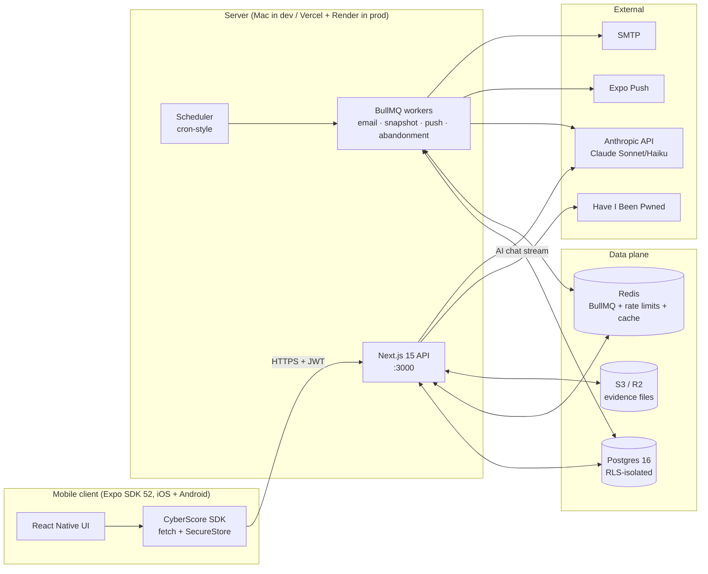
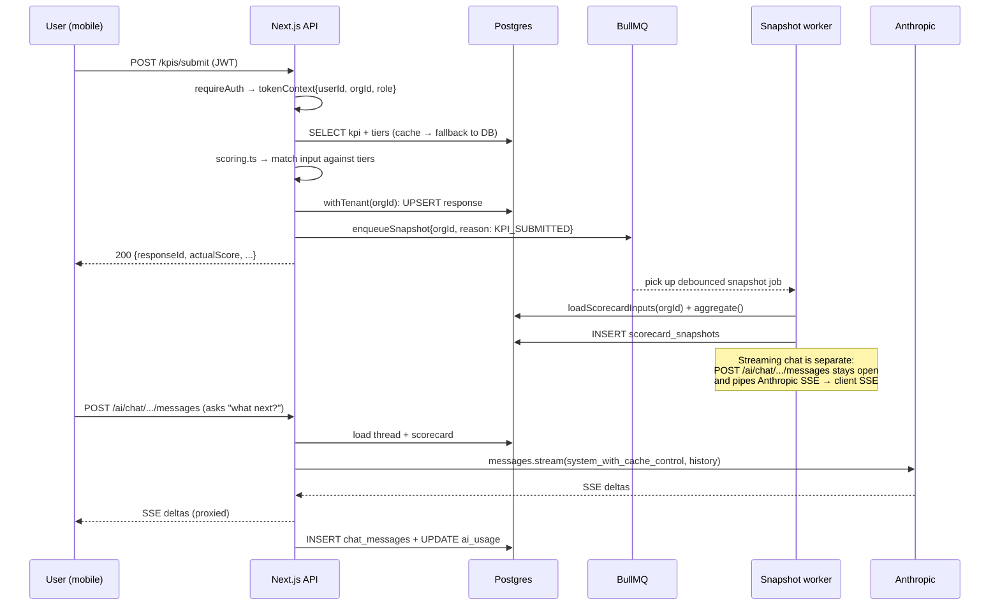

# Architecture

CyberScore is a **multi-tenant SaaS** for organisations to self-assess cybersecurity posture across 46 KPIs and get AI-guided remediation.

## Architecture pattern

**Modular monolith** with a clear seam between request handling (Next.js API routes) and asynchronous work (BullMQ workers). Both processes share the same Prisma client and database, there is no separate microservice.

This is deliberate. At the project's scale (single org → small enterprise teams) microservices would be premature optimisation; a monolith is operationally simpler and faster to iterate on. The separation that *does* exist (workers vs request handlers) is justified because workers need their own Redis connections and shouldn't share request-handler event loops with long-running BullMQ consumers.

## Components

### Mobile app, `apps/mobile`

| | |
|---|---|
| Framework | Expo SDK 52, React Native 0.76.9 |
| Routing | expo-router v4 (file-based) |
| State | Zustand (auth), TanStack Query v5 (server cache) |
| Styling | NativeWind 4 (Tailwind for RN) + inline styles |
| Storage | expo-secure-store (Keychain on iOS, Keystore on Android) |
| Streaming | react-native-sse (XMLHttpRequest-based SSE) |
| Architecture | Old (Bridgeless off), newer libs gated to maintain compatibility |

### API, `apps/api`

| | |
|---|---|
| Framework | Next.js 15.1 (App Router, `output: 'standalone'`) |
| Language | TypeScript 5.7 |
| Auth | JWT (15min) + opaque refresh tokens (7d, bcrypt-hashed at rest) |
| Passwords | Argon2id (OWASP-recommended params) + HIBP breach check on register |
| 2FA | TOTP (RFC 6238), secret AES-GCM encrypted at rest |
| Validation | Zod schemas shared with mobile via `@cyberscore/types` |
| Logging | Pino (structured JSON in prod, pretty in dev) |
| Errors | RFC 7807 Problem Details |

### Workers, `apps/api/src/workers/`

Four BullMQ workers + a scheduler, run as one separate `tsx` process via `npm run worker`:

| Worker | Trigger | What it does |
|---|---|---|
| `email` | Queue jobs | OTP, scorecard PDFs, team invites |
| `snapshot` | Scheduled cron + KPI submission (debounced per org) | Computes scorecard aggregate, writes `scorecard_snapshots` for trend tracking |
| `push` | Queue jobs | Sends to Expo Push API in batches of 100; auto-deactivates invalid tokens |
| `abandonment` | Daily sweep | Identifies stalled assessments at 24h / 72h / 7d; sends re-engagement pushes |

### Shared packages, `packages/`

| | |
|---|---|
| `@cyberscore/types` | Zod schemas + TS types. Source of truth for request/response shapes shared between API and mobile. |
| `@cyberscore/sdk` | `CyberScoreClient` class wrapping `fetch`. Transparent 401 refresh, abort support, error mapping to `ApiError`. |

## Data flow, a representative request

A user submits a KPI answer:

## Tech stack, why each piece

| Choice | Why |
|---|---|
| **Next.js 15 (App Router)** | One framework, one toolchain. Route handlers ≈ Express but with built-in TypeScript, file-based routing, and `output: 'standalone'` for clean Docker images. App Router lets us colocate route handlers without a separate Express layer. |
| **Postgres + Prisma** | Postgres for RLS (true tenant isolation at the DB layer). Prisma for type-safe queries shared between API + workers + the Next-side scripts. Schema-as-source-of-truth, types regenerate on every migration. |
| **BullMQ on Redis** | Battle-tested job queue with built-in retries, dead-letter, scheduling. Redis is already in the stack for rate limits + KPI cache; reusing it costs nothing. |
| **Expo SDK 52** | Single codebase for iOS + Android with OTA updates via EAS Update. Expo Router brings Next-style file-based routing to RN. SecureStore wraps Keychain/Keystore so we don't roll our own. |
| **Argon2id over bcrypt** | OWASP-recommended for new applications. Memory-hard, GPU-resistant. We still use bcrypt for *short* secrets (refresh tokens, OTPs, invite tokens) where argon2's 64MB memory cost would be wasteful. |
| **JWT + refresh tokens** | Stateless access tokens mean the API doesn't hit Postgres on every request just to validate auth. Refresh tokens are opaque + bcrypt-hashed at rest so a DB leak can't be used to impersonate users. |
| **NativeWind over StyleSheet** | Tailwind ergonomics in RN. Falls back to inline styles for dynamic values. Keeps the design system in one place. |
| **Anthropic SDK + prompt caching** | Sonnet 4.5 for quality, Haiku as the budget-exhausted fallback. Prompt caching on the scorecard JSON drops follow-up turns to ~10% of the input cost. |
| **react-native-sse over fetch streaming** | RN 0.76 with old architecture (Bridgeless off) doesn't expose `Response.body` as a usable `ReadableStream`. `react-native-sse` uses XMLHttpRequest under the hood, which streams correctly on both archs. |
| **Zod everywhere** | Single source of truth for request/response shapes. Mobile and API import the same `RegisterRequest` schema; the API parses with it, mobile knows the type without redefinition. |
| **expo-router v4** | File-based routing means navigation structure is visible in the file tree. Typed routes prevent broken links at compile time. |
| **NPM workspaces + Turbo** | Workspaces for monorepo deps, Turbo for cacheable task graphs (`turbo run build` only rebuilds what changed). |

## Key design decisions

### 1. Server-enforced tenant isolation via RLS

Every multi-tenant SaaS bug post-mortem reads the same way: *"we forgot a `WHERE org_id = ?` clause."* RLS makes that bug impossible, Postgres rejects the query before application code can leak data. The cost is that every transaction has to set `app.current_org_id` upfront; the [`withTenant(orgId, fn)`](../apps/api/src/lib/prisma.ts) helper makes this a one-liner.

### 2. Per-user response rows, not per-org

The `responses` table is keyed on `(orgId, kpiId, submittedById)`, every team member can answer independently. The aggregation logic in [`scorecard.ts:rollupResponses`](../apps/api/src/lib/scorecard.ts) handles the join:
- **ORG-scope KPIs** (e.g. "Do we have MFA?"), admin's response is authoritative; employee responses are kept as a consensus signal but don't move the score
- **EMPLOYEE-scope KPIs** (e.g. "Did you complete training?"), averaged across all employees who answered

This decision lets us add team-level analytics ("which employees haven't trained yet?") without restructuring the data model.

### 3. Per-user level permissions, admin-immutable

Employees only see/answer the assessment levels (People/Process/Company) their admin assigned. Admins always have all three regardless of column value, enforced by [`effectiveAllowedLevels()`](../apps/api/src/lib/access.ts). This protects against accidental admin lockout and means the column value for admins is just metadata.

### 4. Prompt caching on the system block, not the messages

The AI chat puts the scorecard JSON in a `system` block with `cache_control: {type: ephemeral}` rather than threading it through messages. This means:
- Turn 1 pays full price on the scorecard
- Turn 2 within 5 minutes pays ~10% on the scorecard (cache read)
- The user's prior turns aren't cached individually, they roll up naturally as the next turn's prefix

JSON serialization is byte-deterministic (we control key order at construction time) so the same scorecard produces the same bytes produces the same cache key.

### 5. Streaming via SSE, persisted alongside

The streaming chat endpoint persists both the user message (immediately) and the full assistant message (after the stream completes), with token usage recorded to `ai_usage`. The mobile client gets an instant optimistic bubble (replaced by the canonical row via `user_message` SSE event), then deltas appended live, then a `done` event with the final ID. Lose the connection mid-stream? The user message is already saved; the next thread fetch reconstructs everything.

### 6. The KPI catalogue is data, not code

The 46 KPIs, their tiers, weights, framework mappings, and remediation suggestions live in `kpis` + `scoring_tiers` + `kpi_suggestions` tables, seeded from `SCORE CARD_KPI_CYBER SEC_PPT_V0.9.xlsx` via [`extract-kpis.py`](../apps/api/prisma/seed/extract-kpis.py). A non-technical admin can edit a KPI's wording or thresholds via the admin API (`PATCH /admin/kpis/:id`) without a deployment. Every edit creates an immutable `kpi_versions` row for audit and reproducibility.

### 7. Audit log is append-only

`audit_logs` has no UPDATE or DELETE policies. Every security-relevant action, logins, KPI submits, password resets, AI calls, team invites, writes a row with actor, IP, before/after JSON. This makes compliance reviews mechanical and protects against post-hoc tampering.

## Deployment topology

See [deployment.md](deployment.md) for the prod runbook. Summary:

- **API** → Vercel (Next.js native), or any Docker-capable host. Image is small thanks to `output: 'standalone'`.
- **Workers** → separate process. In dev: `npm run worker`. In prod: a single container/dyno running the same image with `node ./dist/workers/index.js`.
- **Postgres** → managed (Supabase / Neon / AWS RDS). RLS policies live in `apps/api/prisma/migrations/*/rls.sql`.
- **Redis** → managed (Upstash / Redis Cloud). Used for queues + cache + rate limits.
- **Files** → Cloudflare R2 or AWS S3 for evidence uploads. Presigned URLs; the API never proxies bytes.
- **Mobile** → Expo EAS Build + EAS Submit. OTA updates via EAS Update.